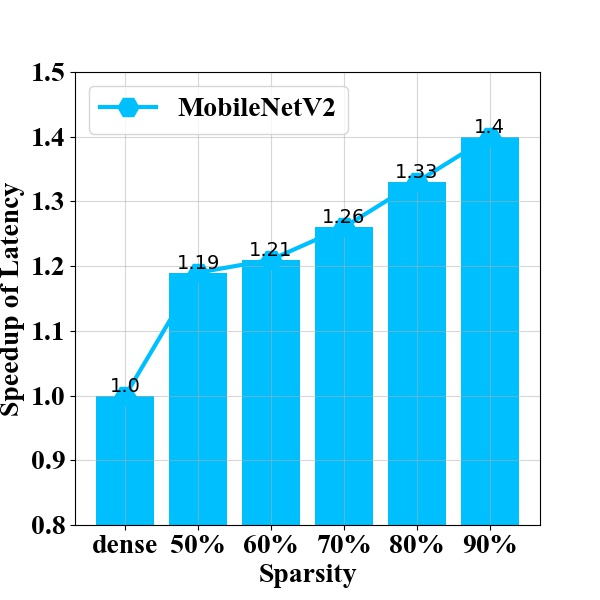

Image Classification Benchmark
==============================

.. _imagenet-SAT-benchmark:

Sparsification-aware Training 
^^^^^^^^^^^^^^^^^^^^^^^^^^^^^^^^^^^^^^^

- **SparseScheduler**: AmbaLevelPruneScheduler

+-----------------+-------+-------+-------+-------+-------+-------+-------+-------+
| Network/sparsity| dense |  30%  |  40%  |  50%  |  60%  |  70%  |  80%  |  90%  |
+=================+=======+=======+=======+=======+=======+=======+=======+=======+
| resnet-18       | 70.28 | 70.35 | 70.57 | 70.45 | 70.25 | 69.81 | 68.75 | 63.84 |
+-----------------+-------+-------+-------+-------+-------+-------+-------+-------+
| resnet-50       | 76.76 | 76.84 | 76.83 | 76.90 | 76.58 | 76.42 | 75.57 | 72.40 |
+-----------------+-------+-------+-------+-------+-------+-------+-------+-------+
| mobilenetv2_0.5 | 65.21 | 64.94 | 64.55 | 63.92 | 62.83 | 60.79 | 56.48 | 46.61 |
+-----------------+-------+-------+-------+-------+-------+-------+-------+-------+
| mobilenetv2_1.0 | 73.26 | 73.22 | 72.85 | 72.48 | 71.84 | 69.95 | 67.53 | 54.90 |
+-----------------+-------+-------+-------+-------+-------+-------+-------+-------+
| mobilenetv2_2.0 | 77.56 | 77.21 | 77.06 | 76.78 | 76.50 | 75.95 | 74.99 | 68.18 |
+-----------------+-------+-------+-------+-------+-------+-------+-------+-------+
| mobilenetv3_s1.0| 67.97 | 58.56 | 58.22 | 56.92 | 56.97 | 53.88 | 51.47 | 44.00 |
+-----------------+-------+-------+-------+-------+-------+-------+-------+-------+
| mobilenetv3_l1.0| 75.17 | 66.24 | 65.82 | 65.40 | 64.67 | 63.31 | 59.66 | 54.70 |
+-----------------+-------+-------+-------+-------+-------+-------+-------+-------+
| regnetx200      | 68.23 | 68.32 | 68.38 | 67.98 | 67.53 | 66.46 | 64.06 | 58.66 |
+-----------------+-------+-------+-------+-------+-------+-------+-------+-------+
| regnetx400      | 71.92 | 72.15 | 72.20 | 71.91 | 71.65 | 70.99 | 69.63 | 64.65 |
+-----------------+-------+-------+-------+-------+-------+-------+-------+-------+
| regnety200      | 69.96 | 70.10 | 69.95 | 69.87 | 69.28 | 68.51 | 65.70 | 58.73 |
+-----------------+-------+-------+-------+-------+-------+-------+-------+-------+
| regnety400      | 73.41 | 73.51 | 73.55 | 73.45 | 73.08 | 72.43 | 70.81 | 63.74 |
+-----------------+-------+-------+-------+-------+-------+-------+-------+-------+

**Speedup of sparse model, measured on CV22 board**

.. _fig_latency_001:
.. figure:: ../../_static/figures/res18_speenup_latency.jpeg
  :align: left
  :scale: 45 %

.. csv-table:: resnet18 on CV22 (inputs_shape=[8,3,224,224], act-force-fx8,coeff-force-fx8)
  :align: right
  :header: "sparsity", "DAGs", "arm_time(ms)", "speedup", "memory_size(MB)", "blob(MB)", "bandwidth(MB)"
  :widths: 10, 10, 10, 10, 10, 10, 10

  "dense", 9, 18.19, 1.00, 12.20, 0.45, 13.02
  "50%",   6, 10.80, **1.70**, 8.01 , 0.31, 8.31
  "60%",   6, 9.29 , **1.96**, 6.85 , 0.37, 7.21
  "70%",   5, 7.60 , **2.39**, 5.50 , 0.36, 5.84
  "80%",   3, 5.86 , **3.10**, 3.94 , 0.28, 4.06
  "90%",   2, 4.46 , **4.08**, 2.25 , 0.25, 2.33

.. _fig_latency_002:

.. csv-table:: mobilenetv2_1 on CV22 (inputs_shape=[8,3,224,224], act-force-fx8,coeff-force-fx8)
  :align: right
  :header: "sparsity", "DAGs", "arm_time(ms)", "speedup", "memory_size(MB)", "blob(MB)", "bandwidth(MB)"
  :widths: 10, 10, 10, 10, 10, 10, 10

  "dense", 5, 33.94, 1.00, 6.51, 2.87, 9.07
  "50%", 4, 28.39, **1.19**, 6.80, 4.33, 10.95
  "60%", 4, 28.16, **1.21**, 5.96, 3.87,  9.65
  "70%", 4, 26.86, **1.26**, 5.49, 3.81,  9.11
  "80%", 4, 25.50, **1.33**, 5.37, 4.15,  9.19
  "90%", 4, 24.28, **1.40**, 4.16, 3.44,  7.94

.. note::
  All experiments use the following sparsity_config

  .. code-block:: python

    sparsity:
      mask_generator:
        type: NormalMaskGenerator
      fake_sparse:
        type: FakeSparse
      scheduler:
        type: AmbaLevelPruneScheduler
        kwargs:
          total_iters: None
          sparsity_table: [30,40,50,60,70,80,90]
          no_prune_keyword: ''
          no_prune_layer: ''
          prun_algo: 1
          prun_algo_tuning: 0.5
          dw_no_prune: False
          do_sparse_analysis: False
          default_input_shape: [1,3,224,224]
          output_dir: path_to_sparse_analysis
          save_dir: path_to_sparse_ckpts

- **SparseScheduler**: AmpereScheduler

+--------------------+-------+-------+
| Network/sparsity   | dense |  50%  |
+--------------------+-------+-------+
| resnet-18          | 70.28 | 70.02 |
+--------------------+-------+-------+
| resnet-50          | 76.76 | 76.75 |
+--------------------+-------+-------+
| regnetx200         | 68.23 | 68.04 |
+--------------------+-------+-------+
| regnetx400         | 71.92 | 71.25 |
+--------------------+-------+-------+
| regnety200         | 69.96 | 69.66 |
+--------------------+-------+-------+
| regnety400         | 73.41 | 73.71 |
+--------------------+-------+-------+

.. note::
  All experiments use the following sparsity_config

  .. code-block:: python

    sparsity:
      scheduler:
        type: AmpereScheduler
        kwargs:
          mask_calculator: m4n2_1d
          allow_recompute_mask: False
          allow_permutation: False
          verbosity: 0

Post-training Sparsification
^^^^^^^^^^^^^^^^^^^^^^^^^^^^^^^^^^^^^^^

- **post-training sparsification without progressive reconstruction**

iterations = 20000, cali_size = 1024

+------------------------+---------------------+-------+-------+-------+-------+
| Network/sparsity       | reconstruction      |  30%  |  40%  |  50%  |  60%  |
+========================+=====================+=======+=======+=======+=======+
| resnet-18(71.00)       |     No              | 68.97 | 64.52 | 48.23 | 18.39 |
+                        +---------------------+-------+-------+-------+-------+
|                        | Yes(layer-wise)     | 70.80 | 70.55 | 70.19 | 69.36 |
+------------------------+---------------------+-------+-------+-------+-------+
| resnet-50(76.62)       |     No              | 75.36 | 72.53 | 60.69 | 33.38 |
+                        +---------------------+-------+-------+-------+-------+
|                        | Yes(layer-wise)     | 76.44 | 76.21 | 75.84 | 74.41 |
+------------------------+---------------------+-------+-------+-------+-------+
| mobilenetv2_1.0(72.63) |     No              | 33.72 | 1.75  |  0.18 |  0.10 |
+                        +---------------------+-------+-------+-------+-------+
|                        | Yes(layer-wise)     | 70.86 | 68.65 | 63.29 | 49.23 |
+------------------------+---------------------+-------+-------+-------+-------+
| regnetx-600(73.52)     |     No              | 71.15 | 64.76 | 43.54 | 1.33  |
+                        +---------------------+-------+-------+-------+-------+
|                        | Yes(layer-wise)     | 73.35 | 73.07 | 72.43 | 70.97 |
+------------------------+---------------------+-------+-------+-------+-------+

+------------------------+---------------------+-------+-------+-------+-------+
| Network/sparsity       | pts pattern         |  30%  |  40%  |  50%  |  60%  |
+========================+=====================+=======+=======+=======+=======+
| resnet-18(71.00)       |     block-wise      | 70.81 | 70.69 | 70.25 | 69.20 |
+                        +---------------------+-------+-------+-------+-------+
|                        |     layer-wise      | 70.80 | 70.55 | 70.19 | 69.36 |
+------------------------+---------------------+-------+-------+-------+-------+
| mobilenetv2_1.0(72.63) |     block-wise      | 70.93 | 68.96 | 64.34 | 53.69 |
+                        +---------------------+-------+-------+-------+-------+
|                        |     layer-wise      | 70.86 | 68.65 | 63.29 | 49.23 |
+------------------------+---------------------+-------+-------+-------+-------+
| resnet-50(76.62)       |     block-wise      | 76.56 | 76.22 | 75.75 | 74.51 |
+                        +---------------------+-------+-------+-------+-------+
|                        |     layer-wise      | 76.44 | 76.21 | 75.84 | 74.41 |
+------------------------+---------------------+-------+-------+-------+-------+
| regnetx-600(73.52)     |     block-wise      | 73.32 | 72.95 | 72.43 | 71.22 |
+                        +---------------------+-------+-------+-------+-------+
|                        |     layer-wise      | 73.35 | 73.07 | 72.43 | 70.97 |
+------------------------+---------------------+-------+-------+-------+-------+

+------------------------+---------------------+-------+-------+-------+-------+
| Network/sparsity       | cali_size(block)    |  30%  |  40%  |  50%  |  60%  |
+========================+=====================+=======+=======+=======+=======+
| mobilenetv2_1.0(72.63) |     512             | 70.92 | 68.48 | 63.16 | 50.86 |
+                        +---------------------+-------+-------+-------+-------+
|                        |     1024            | 70.93 | 68.96 | 64.34 | 53.69 |
+                        +---------------------+-------+-------+-------+-------+
|                        |     2048            | 71.17 | 69.42 | 65.51 | 55.19 |
+------------------------+---------------------+-------+-------+-------+-------+

.. note::
  All experiments use the following sparsity_config

  .. code-block:: python

    sparsity:
      cali_batchsize: 16 # means all calidata num is 16 * batchsize
      reconstruction:
          pattern: layer
          max_count: 20000      # iterations for layer weight
          keep_gpu: True
          weight_lr: 0.00001    # for layer weight
      mask_generator:
        type: NormalMaskGenerator
        kwargs:
          sparsity: 0.5 # choose in [0.3, 0.4, 0.5, 0.6]
      fake_sparse:
        type: FakeSparse
      scheduler:
        type: BaseScheduler

- **post-training sparsification with progressive reconstruction**

+------------------------+-------+-------+-------+-------+-------+-------+
| Network/sparsity       |  10%  |  20%  |  30%  |  40%  |  50%  |  60%  |
+========================+=======+=======+=======+=======+=======+=======+
| resnet-18( 5000)       | 70.98 | 70.89 | 70.86 | 70.62 | 70.10 | 69.27 |
+------------------------+-------+-------+-------+-------+-------+-------+
| resnet-18(10000)       | 70.99 | 70.92 | 70.85 | 70.60 | 70.28 | 69.51 |
+------------------------+-------+-------+-------+-------+-------+-------+
| resnet-18(20000)       | 70.97 | 70.96 | 70.83 | 70.62 | 70.24 | 69.47 |
+------------------------+-------+-------+-------+-------+-------+-------+
| resnet-50( 5000)       | 76.62 | 76.58 | 76.50 | 76.22 | 75.73 | 74.45 |
+------------------------+-------+-------+-------+-------+-------+-------+
| resnet-50(10000)       | 76.65 | 76.60 | 76.52 | 76.19 | 75.77 | 74.55 |
+------------------------+-------+-------+-------+-------+-------+-------+
| resnet-50(20000)       | 76.63 | 76.52 | 76.45 | 76.35 | 75.75 | 74.69 |
+------------------------+-------+-------+-------+-------+-------+-------+
| mobilenetv2_1.0( 5000) | 72.45 | 72.05 | 70.97 | 68.78 | 63.28 | 49.64 |
+------------------------+-------+-------+-------+-------+-------+-------+
| mobilenetv2_1.0(10000) | 72.36 | 71.96 | 70.95 | 68.55 | 63.40 | 51.52 |
+------------------------+-------+-------+-------+-------+-------+-------+
| mobilenetv2_1.0(20000) | 72.43 | 71.86 | 70.50 | 68.01 | 62.65 | 51.39 |
+------------------------+-------+-------+-------+-------+-------+-------+
| regnetx-600( 5000)     | 73.51 | 73.40 | 73.38 | 73.10 | 72.55 | 70.95 |
+------------------------+-------+-------+-------+-------+-------+-------+
| regnetx-600(10000)     | 73.50 | 73.39 | 73.38 | 73.14 | 72.46 | 71.01 |
+------------------------+-------+-------+-------+-------+-------+-------+
| regnetx-600(20000)     | 73.53 | 73.42 | 73.40 | 73.10 | 72.38 | 71.12 |
+------------------------+-------+-------+-------+-------+-------+-------+

.. note::
  All experiments use the following sparsity_config

  .. code-block:: python

    sparsity:
      progressive: 
          sparsity_tables: [0.1, 0.2, 0.3, 0.4, 0.5, 0.6]
      cali_batchsize: 16 # means all calidata num is 16 * batchsize
      reconstruction:
          pattern: layer
          max_count: 10000      # iterations for layer weight [5000, 10000, 20000]
          keep_gpu: True
          weight_lr: 0.00001    # for layer weight
      mask_generator:
        type: NormalMaskGenerator
      fake_sparse:
        type: FakeSparse
      scheduler:
        type: BaseScheduler
