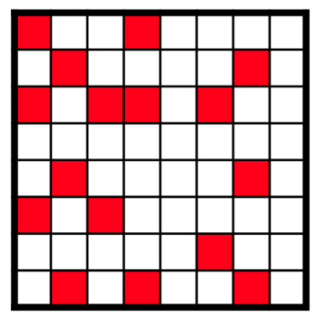

CVflow (on Ambarella CV2x Chip) 
=============================== 

Introduction
^^^^^^^^^^^^

Today, sparsity methods include unstructured sparsity, structured sparsity, and more.

CVflow benefits exclusively from **unstructured sparsity (sparsification)**, as it includes a high density of zero-valued coefficients. 
Because the CVflow execution engine can bypass known results without performing the MAC, there is a direct acceleration 
when the system is MAC-limited. Users can achieve a low non-zero coefficient density while retaining accuracy and receiving 
a 3x―4x speed boost on many networks.

.. _CVflow Sparsification Scheme:

**Ambarella CV2x Chip** supports deploying models that conform to unstructured sparsity and supports non-uniform sparsity, 
that is, different layers of the model can have different sparsity.

.. _cvflow_fig_001:

  *Fig1. A unstructured sparsity sparse matrix W*

Deploy on CVflow
^^^^^^^^^^^^^^^^^^

**Requirements**:

- Get the  environment settings and tools required  from Ambarella for running CNNGen 

**Deployment**:

We provide the example to deploy the model with unstructured sparse pattern to CVflow.

- Start with a dense network. The goal is to start with a known-good model whose weights have converged to give useful results.

- On the dense network, prune the weights to satisfy the unstructured sparsity criteria.

- Start the sparsification-aware training procedure.

- After completing sparsification-aware training, export the sparse model to ONNX [cvflow_deploy_model.onnx]

    .. code-block:: python
        :linenos:

        torch.onnx.export(sparse_model.eval(), dummy_input, "cvflow_deploy_model.onnx", verbose=True, opset_version=10, enable_onnx_checker=False)

- Start the docker: 

    .. code-block:: shell
        :linenos:

        docker run -it --gpus all --name YYYY -v /data1/user/xxx/:/data registry.sensetime.com/nart/nart:1.2.11-dev-cvflow-ddb87c57 /bin/bash

- Then, generate the Cavalry binary file (bvlc_sparse_model_cavalry.bin).

    .. code-block:: shell
        :linenos:

        onnx_print_graph_summary.py -p cvflow_deploy_model.onnx -v -isrc "i:data|is:1,3,224,224"
        graph_surgery.py onnx -m cvflow_deploy_model.onnx -t Default
        onnxparser.py -m cvflow_deploy_model_modified.onnx -i path_to_cali_data/cali_data_bin_list.txt -o bvlc_sparse_model -of out_bvlc_sparse_model_parser  -iq -idf 1,2,0,7 -odst "o:out|odf:fp32" -c act-force-fx8,coeff-force-fx8
        cd out_bvlc_sparse_model_parser
        vas -auto -summary -show-progress -dvi bvlc_sparse_model.vas
        cd ..
        ades_autogen.py -v bvlc_sparse_model -p out_bvlc_sparse_model_parser/ -l ades_bvlc_sparse_model -ib data=path_to_the_calidata.bin -ifp32 -ofp32
        cd ades_bvlc_sparse_model
        ades bvlc_sparse_model_ades.cmd
        cd ..
        cavalry_gen -d out_bvlc_sparse_model_parser/vas_output/ -f bvlc_sparse_model_cavalry.bin -p ./ -v
        

- Finally, deploy on CVflow, and do the inference.

    .. code-block:: shell
        :linenos:

        modprobe cavalry
        cavalry_load -f /lib/firmware/cavalry.bin -r
        test_nnctrl -b bvlc_sparse_model_cavalry.bin --in data=input.bin  -e

Reference
^^^^^^^^^^^^^^^^^^

[1]. Ambarella_CV2x_UG_Flexible_Linux_SDK3.0_CNNGen_Development_Flow.pdf
