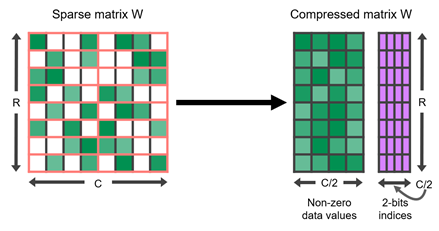

TensorRT (on NVIDIA Ampere Architecture)
========================================

Introduction
^^^^^^^^^^^^

Today, NVIDIA is releasing  `TensorRT version 8.0 <https://developer.nvidia.com/tensorrt>`_ , which introduces support for the Sparse Tensor Cores available on the NVIDIA Ampere Architecture GPUs.

TensorRT is an SDK for high-performance deep learning inference, which includes an optimizer and runtime that minimizes latency and maximizes 
throughput in production. Using a simple training workflow and deploying with TensorRT 8.0, Sparse Tensor Cores can eliminate unnecessary calculations in neural networks, resulting in over 30% performance/watt gain compared to dense networks.

.. _TensorRT Sparsification Scheme:

**Sparse Tensor Cores accelerate 2:4 fine-grained structured sparsity**

The **NVIDIA A100 GPU**  adds support for fine-grained structured sparsity to its Tensor Cores.  Sparse Tensor Cores accelerate a **2:4 sparsity pattern**. 
In each contiguous block of four values, two values must be zero. This naturally leads to a sparsity of **50%** , which is fine-grained. 
There are no vector or block structures pruned together. Such a regular pattern is easy to compress and has a low metadata overhead, as shown in Fig1.

.. _fig_001:

  *Fig1. A 2:4 structured sparse matrix W, and its compressed representation*

Sparse Tensor Cores accelerate this format by operating only on the nonzero values in the compressed matrix. 
They use the metadata that is stored with the nonzeros to pull only the necessary values from the other, uncompressed operand. 
So, for a sparsity of 2x, they can complete the same effective calculation in half the time. Table 1 shows details on the wide
variety of data types supported by Sparse Tensor Cores.

Deploy on TensorRT
^^^^^^^^^^^^^^^^^^

**Requirements**:

- Install TensorRT=8.2.1.8 from `NVIDIA <https://developer.nvidia.com/tensorrt/>`_

**Deployment**:

We provide the example to deploy the model with 2:4 sparse pattern to TensorRT.

- Start with a dense network. The goal is to start with a known-good model whose weights have converged to give useful results.

- On the dense network, prune the weights to satisfy the 2:4 structured sparsity criteria. Out of every four elements, remove just two.

- Start the sparsification-aware training procedure.

- After completing sparsification-aware training, export the sparse model to ONNX [tensorrt_deploy_model.onnx]

    .. code-block:: python
        :linenos:

        torch.onnx.export(sparse_model.eval(), dummy_input, "tensorrt_deploy_model.onnx", verbose=True, opset_version=10, enable_onnx_checker=False)

- Then, build the TensorRT Sparse engine, please make sure **--sparsity=enable** or **--sparsity=best**

    .. code-block:: shell
        :linenos:

        trtexec --onnx=./tensorrt_deploy_model.onnx --saveEngine=tensorrt_deploy_model.trt  --sparsity=enable --best --iterations=100 --workspace=80000

- Finally, deploy on TensorRT, and do the inference.

    .. code-block:: shell
        :linenos:

        trtexec --loadEngine=tensorrt_deploy_model.trt

Reference
^^^^^^^^^^^^^^^^^^

`[1]. Developer Guide :: NVIDIA Deep Learning TensorRT Documentation <https://docs.nvidia.com/deeplearning/tensorrt/developer-guide/index.html>`_

`[2]. Accelerating Inference with Sparsity Using the NVIDIA Ampere Architecture and NVIDIA TensorRT <https://developer.nvidia.com/blog/accelerating-inference-with-sparsity-using-ampere-and-tensorrt/>`_
